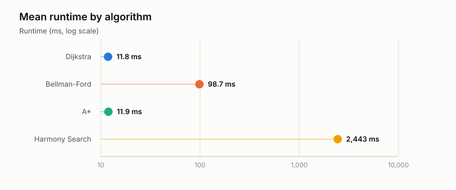
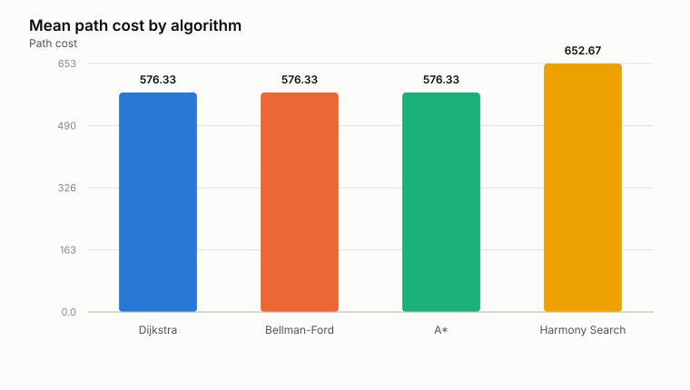
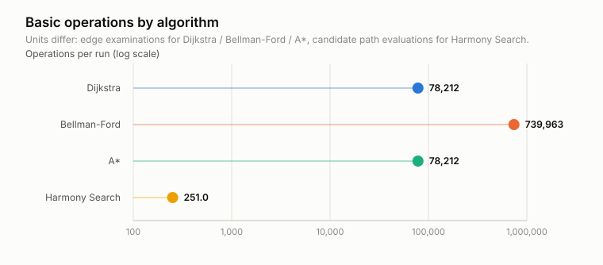
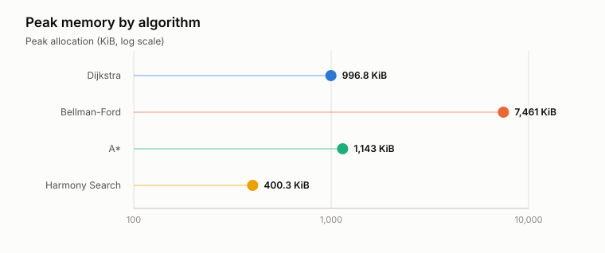
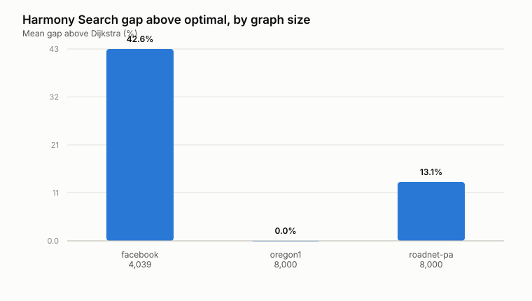

# Experiment Results Summary

Source CSV: `../../raw/real_experiment.csv`

## Machine used to generate these results

- Operating system: Windows 11 (AMD64)
- Processor: Intel64 Family 6 Model 183 Stepping 1, GenuineIntel
- Logical CPUs: 24
- Physical memory: 31.76 GB
- Python: CPython 3.14.3

## Visuals

## Algorithm averages

Runtime, path cost, and operation counts come from clean timing runs. Peak memory comes from separate runs instrumented with `tracemalloc`, which inflates runtime and is therefore never mixed into the timing columns.

| Algorithm | Mean runtime (ms) | Mean path cost | Basic operations | Peak memory (KiB) | Success rate |
| --- | ---: | ---: | ---: | ---: | ---: |
| Dijkstra | 11.834 | 576.333 | 78,212 | 996.8 | 100.0% |
| Bellman-Ford | 98.657 | 576.333 | 739,963 | 7,460.7 | 100.0% |
| A* | 11.941 | 576.333 | 78,212 | 1,143.5 | 100.0% |
| Harmony Search | 2442.530 | 652.667 | 251 | 400.3 | 100.0% |

## Harmony Search solution quality by input

| Input (nodes) | Mean gap above optimal |
| --- | ---: |
| facebook - 4,039 | 42.65% |
| oregon1 - 8,000 | 0.00% |
| roadnet-pa - 8,000 | 13.07% |

## Interpretation

- The data includes 57 timing runs and 12 memory runs across 3 graph instance(s).
- `dijkstra` had the fastest average runtime in this run.
- `dijkstra` had the lowest average path cost.
- Harmony Search averaged 76.333 cost units (18.6%) above Dijkstra, and matched the optimal cost on 33.3% of runs.
- Dijkstra is the exact benchmark, so it anchors the path-quality comparison.
- Bellman-Ford is expected to be slower because it relaxes every edge on every pass.
- A* uses a zero heuristic here, so it is algorithmically equivalent to Dijkstra; any runtime difference between the two is measurement noise, not a real speedup.
- Harmony Search is approximate; the question is whether its path cost stays close enough to Dijkstra to justify the extra runtime, and whether that holds as graphs grow.
