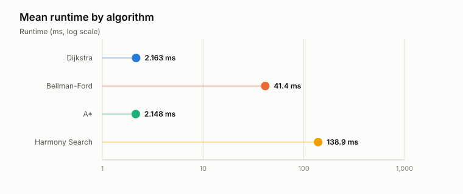
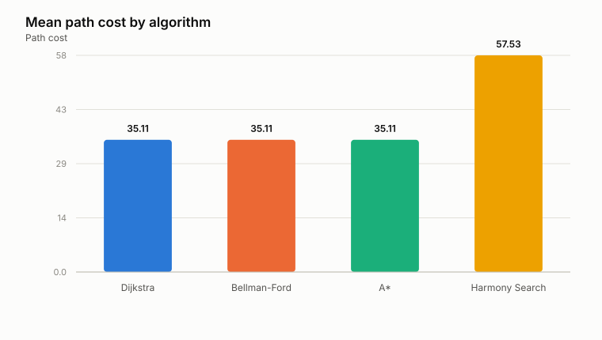
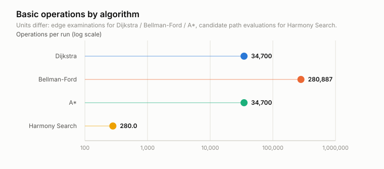
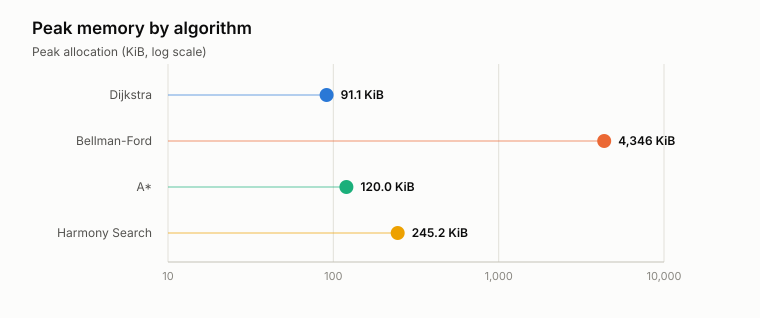
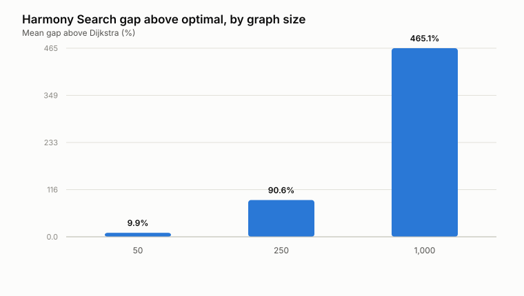

# Experiment Results Summary

Source CSV: `../raw/checkpoint_experiment.csv`

## Machine used to generate these results

- Operating system: Windows 11 (AMD64)
- Processor: Intel64 Family 6 Model 183 Stepping 1, GenuineIntel
- Logical CPUs: 24
- Physical memory: 31.76 GB
- Python: CPython 3.14.3

## Visuals

## Algorithm averages

Runtime, path cost, and operation counts come from clean timing runs. Peak memory comes from separate runs instrumented with `tracemalloc`, which inflates runtime and is therefore never mixed into the timing columns.

| Algorithm | Mean runtime (ms) | Mean path cost | Basic operations | Peak memory (KiB) | Success rate |
| --- | ---: | ---: | ---: | ---: | ---: |
| Dijkstra | 2.163 | 35.111 | 34,700 | 91.1 | 100.0% |
| Bellman-Ford | 41.437 | 35.111 | 280,887 | 4,346.2 | 100.0% |
| A* | 2.148 | 35.111 | 34,700 | 120.0 | 100.0% |
| Harmony Search | 138.850 | 57.527 | 280 | 245.2 | 100.0% |

## Harmony Search solution quality by input

| Input (nodes) | Mean gap above optimal |
| --- | ---: |
| 50 | 9.92% |
| 250 | 90.61% |
| 1,000 | 465.06% |

## Interpretation

- The data includes 1215 timing runs and 108 memory runs across 27 graph instance(s).
- `astar` had the fastest average runtime in this run.
- `dijkstra` had the lowest average path cost.
- Harmony Search averaged 22.416 cost units (188.5%) above Dijkstra, and matched the optimal cost on 40.2% of runs.
- Dijkstra is the exact benchmark, so it anchors the path-quality comparison.
- Bellman-Ford is expected to be slower because it relaxes every edge on every pass.
- A* uses a zero heuristic here, so it is algorithmically equivalent to Dijkstra; any runtime difference between the two is measurement noise, not a real speedup.
- Harmony Search is approximate; the question is whether its path cost stays close enough to Dijkstra to justify the extra runtime, and whether that holds as graphs grow.
